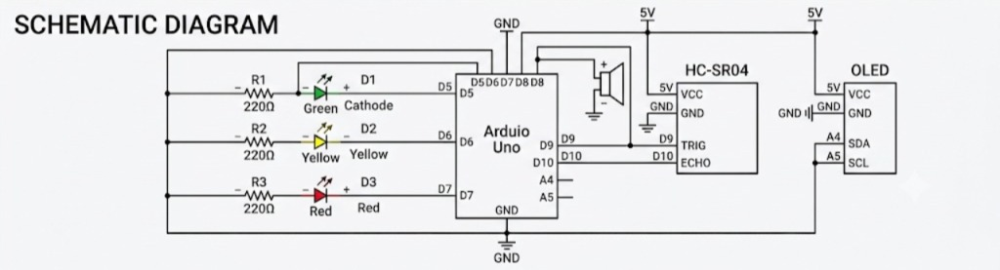
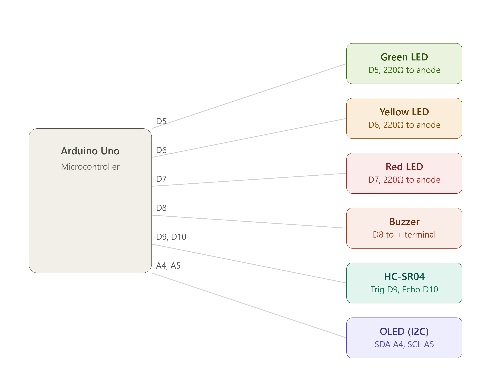
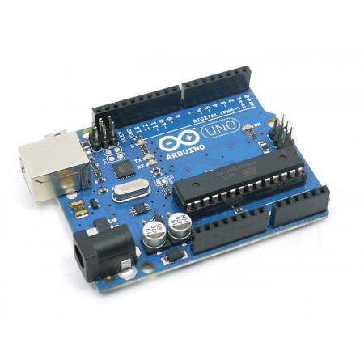
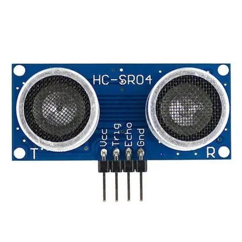
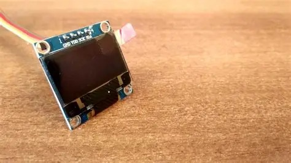

# A.M.N (Aliya Maari Nilku) 🎯

## Basic Details
### Team Name: The Unplanned

### Team Members
- Member 1: Nissy - CEC
- Member 2: Athira - CEC

### Project Description
A.M.N (Aliya Maari Nilku) – A Gloriously Unnecessary Proximity Shaming Device
An Arduino contraption that solves a problem nobody actually asked it to solve: it uses an ultrasonic sensor to detect when you're standing too close to someone, then passive-aggressively insults you about it via an OLED display, blinks an LED like it's judging you, and beeps with increasing urgency until you take the hint. It doesn't fix your personal space issues it just narrates them, with escalating sarcasm and a "closing speed" feature so it can roast you even faster.

### The Problem (that doesn't exist)
An Arduino contraption built to fix a crisis nobody was having: people standing slightly too close to each other, a situation humanity has survived for millennia without electronic intervention. It uses an ultrasonic sensor to detect the "violation," then passive-aggressively roasts you on an OLED display, blinks an LED like it's personally disappointed in you, and beeps with escalating urgency  because apparently saying "hey, back up" out loud was too much to ask. Bonus: it even detects how fast you're invading someone's space, so it can judge you in real time.

### The Solution (that nobody asked for)
An Arduino contraption engineered to fix a problem that solved itself for thousands of years with a simple "excuse me": people standing too close. It uses an ultrasonic sensor to detect the "violation," then passive-aggressively roasts you on an OLED display, blinks an LED like it's personally judging your life choices, and beeps with escalating urgency until you back off. It even tracks how fast you're invading someone's space — because regular judgment apparently wasn't extra enough.
## Technical Details
### Technologies/Components Used

- Arduino UNO
- OLED Display
- HC-SR04
- LED
- BUZZER
- Arduino IDE

## Project Documentation

### Schematic & Circuit

#### Pin Configuration

**Figure 1. Pin Configuration:**  
The pin configuration shows the connections between the Arduino Uno and the major components of the A.M.N. system. The three LEDs are connected to digital pins D5, D6, and D7 through 220Ω current-limiting resistors. The active buzzer is connected to D8. The HC-SR04 ultrasonic sensor uses D9 as TRIG and D10 as ECHO. The 0.96-inch I²C OLED display uses A4 for SDA and A5 for SCL.

#### Schematic Diagram

**Figure 2. Schematic Diagram:**  
The schematic represents the complete electrical connections of the A.M.N. prototype. The Arduino Uno serves as the main controller and interfaces with the ultrasonic sensor, OLED display, LEDs, and buzzer. The LEDs are connected through 220Ω resistors for current limiting, while the components share a common ground.

#### Circuit Wiring Overview

**Figure 3. Circuit Wiring Overview:**  
This diagram provides a clear component-level view of the wiring used in the A.M.N. prototype. It shows the Arduino Uno connections to the three status LEDs, active buzzer, HC-SR04 ultrasonic sensor, and I²C OLED display.

### Components

#### Arduino Uno

**Figure 4. Arduino Uno:**  
The Arduino Uno acts as the central controller of the A.M.N. system. It reads the distance measured by the HC-SR04 ultrasonic sensor, determines the appropriate proximity level, and controls the OLED display, LEDs, and buzzer accordingly.

#### HC-SR04 Ultrasonic Sensor

**Figure 5. HC-SR04 Ultrasonic Sensor:**  
The HC-SR04 is used to measure the distance between the A.M.N. device and a nearby person. It operates by transmitting an ultrasonic pulse and measuring the time taken for the echo to return. The Arduino uses this measurement to determine the proximity level.

#### OLED Display

**Figure 6. OLED Display:**  
The 0.96-inch I²C OLED display provides visual feedback to the user. It displays the detected distance, current safety status, and humorous messages corresponding to different proximity levels.

### Build Photos

#### Component Assembly

The individual components were first tested and then connected according to the pin configuration and schematic. The Arduino Uno, HC-SR04 ultrasonic sensor, OLED display, LEDs, and active buzzer were assembled on a breadboard using jumper wires.

The LEDs were connected through 220Ω resistors, and the I²C OLED was connected to the Arduino's SDA and SCL pins.

#### Final Prototype

**Figure 7. Final Prototype:**  
The completed A.M.N. prototype assembled on a breadboard and tested during operation. The physical prototype integrates the Arduino Uno, HC-SR04 ultrasonic sensor, OLED display, three status LEDs, and active buzzer into a single proximity-alert system.

### Working Principle

A.M.N. continuously measures the distance of a nearby person using the HC-SR04 ultrasonic sensor. The Arduino Uno processes the measured distance and compares it with predefined proximity thresholds.

Based on the detected distance, the system activates the corresponding LED, buzzer response, and OLED message.

| Distance | Alert Level | LED | Buzzer Response |
|---|---|---|---|
| > 25 cm | SAFE | Green | OFF |
| 20–25 cm | LOW ALERT | Yellow | Slow short beeps |
| 10–20 cm | MEDIUM ALERT | Yellow | Faster beeps |
| ≤ 10 cm | HIGH ALERT | Red | Rapid beeping |

The system follows the basic engineering sequence:

**Sense → Process → Decide → Act**

1. **Sense:** The HC-SR04 measures the distance.
2. **Process:** Arduino calculates the distance from the sensor.
3. **Decide:** The measured distance is compared with the predefined thresholds.
4. **Act:** The appropriate LED, buzzer, and OLED response is activated.

### Build Process

1. The Arduino Uno was placed on the breadboard and connected to the common power and ground rails.
2. The HC-SR04 ultrasonic sensor was connected using D9 for TRIG and D10 for ECHO.
3. The three LEDs were connected to D5, D6, and D7 through 220Ω resistors.
4. The active buzzer was connected to D8.
5. The OLED display was connected through the I²C interface using A4 (SDA) and A5 (SCL).
6. The individual components were tested to verify their operation.
7. The complete circuit was assembled and the distance-based responses were tested at different proximity levels.

### Project Demonstration

The completed prototype was tested at different distances to verify the corresponding LED, buzzer, and OLED responses. As a person approaches the device, the alert level increases, making the system progressively more dramatic.

[▶ Watch the Demo Video](demo.mp4)

## Team Contributions
- [ATHIRA ANILKUMAR]: [Hardware testing and integration , circuit assembly, testing and documentation]
- [NISSY ELSA SUNIL]: [Hardware testing and integration , circuit assembly, testing and documentation]
---
Made with ❤️ at TinkerHub Useless Projects 

